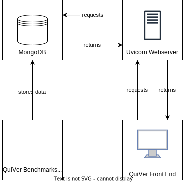

# QuiVer Benchmarks

QuiVer Benchmarks is a tool that helps you decide which OCR-D workflows are most suitable for your data.
It executes preset workflows on [different kinds of Ground Truth](#ground-truth-used) and evaluates the result.
The results with the most recent version of [ocrd_all](https://github.com/OCR-D/ocrd_all) can be viewed at [https://ocr-d.de/quiver-frontend](https://ocr-d.de/quiver-frontend/#/workflows?view=list).

This repository holds everything needed to automatically execute different OCR-D workflows on images and evaluate the outcomes.
It creates benchmarks for OCR-D data in a containerized environment.
QuiVer Benchmarks currently runs in an automated workflow (CI/CD).

QuiVer Benchmarks is based on `ocrd/all:maximum` and has all OCR-D processors at hand that a workflow might use.

## Requirements

- Docker >= 23.0.0
- [Docker Compose plugin](https://docs.docker.com/compose/install/linux/#install-using-the-repository)
- make

To speed up QuiVer Benchmarks you can mount already downloaded text recognition models to `/usr/local/share/ocrd-resources/` in `docker-compose.yml` by adding

```yml
- path/to/your/models:/usr/local/share/ocrd-resources/
```

to the `volumes` section.
Otherwise, the tool will download all `ocrd-tesserocr-recognize` models as well as `ocrd-calamari-recognize qurator-gt4histocr-1.0` on each run.

## Usage (For Development)

- clone this repository and switch to the cloned directory
- build the image with `make build`
- spin up a container with `make start`
- run `make prepare-default-gt`
- run `make run` to run all workflows. In order to run 1 or more worfklows, see [quiver CLI](#quiver-cli).
- the benchmarks and the evaluation results will be available at `data/workflows.json` on your host system
- when finished, run `make stop` to shut down and remove the Docker container you created previously

### quiver CLI

The `quiver` CLI tool enables users to choose which OCR-D workflows are run on the Ground Truth provided.
After each run of an OCR-D workflow, an evaluation workflow (`dinglehopper_eval.txt`) is executed to obtain the relevant metrics.

**Note:** All workflows have to be placed in `workflows/ocrd_worflows`. See also [Adding New OCR-D Workflows](#adding-new-ocr-d-workflows).

Parameters:

- `-wf / --workflow` the workflows to be executed on the data. Defaults to `all` where all available workflows are executed. Repeatable.

Sample calls:

```bash
# runs all workflows in workflows/ocrd_worflows on all data in gt/
docker compose exec app quiver run-ocr

# runs all workflows/ocrd_worflows/minimal_ocr.txt on all data in gt/
docker compose exec app quiver run-ocr -wf minimal_ocr.txt

# runs both minimal_ocr.txt and slower_processors_or.txt on all data in gt/
docker compose exec app quiver run-ocr -wf minimal_ocr.txt -wf slower_processors_ocr.txt 
```

## Benchmarks Considered

The relevant benchmarks gathered by QuiVer Benchmarks are defined in [OCR-D's Quality Assurance specification](https://ocr-d.de/en/spec/eval) and comprise

- CER (per page and document wide), incl.
  - median
  - minimum and maximum CER
  - standard deviation
- WER (per page and document wide)
- CPU time
- wall time
- processed pages per minute

## Ground Truth Used

QuiVer Benchmarks currently uses the following Ground Truth:

- [https://github.com/tboenig/16_frak_simple](https://github.com/tboenig/16_frak_simple)
- [https://github.com/tboenig/17_frak_simple](https://github.com/tboenig/17_frak_simple)
- [https://github.com/tboenig/17_frak_complex](https://github.com/tboenig/17_frak_complex)
- [https://github.com/tboenig/18_frak_simple](https://github.com/tboenig/18_frak_simple)
- [https://github.com/tboenig/18_frak_complex](https://github.com/tboenig/18_frak_complex)
- [https://github.com/tboenig/19_frak_simple](https://github.com/tboenig/19_frak_simple)
- [https://github.com/tboenig/16_ant_simple](https://github.com/tboenig/16_ant_simple)
- [https://github.com/tboenig/16_ant_complex](https://github.com/tboenig/16_ant_complex)
- [https://github.com/tboenig/18_ant_simple](https://github.com/tboenig/18_ant_simple)
- [https://github.com/tboenig/19_ant_simple](https://github.com/tboenig/19_ant_simple)
- [https://github.com/tboenig/17_fontmix_simple](https://github.com/tboenig/17_fontmix_simple)
- [https://github.com/tboenig/18_fontmix_complex](https://github.com/tboenig/18_fontmix_complex)
- [Reichsanzeiger GT](https://github.com/UB-Mannheim/reichsanzeiger-gt) with many ads
- [Reichsanzeiger GT](https://github.com/UB-Mannheim/reichsanzeiger-gt) with many tables
- [Reichsanzeiger GT](https://github.com/UB-Mannheim/reichsanzeiger-gt) title pages only
- [Reichsanzeiger GT](https://github.com/UB-Mannheim/reichsanzeiger-gt) random selection of pages

A detailed list of images used for the Reichsanzeiger GT sets can be found in the `data_src` directory.

### Adding New OCR-D Workflows (For Development)

Add new OCR-D workflows to the directory `workflows/ocrd_worflows` according to the following conventions:

- OCR workflows have to end with `_ocr.txt`, evaluation workflows with `_eval.txt`. The files will be converted by [OtoN](https://github.com/MehmedGIT/OtoN_Converter) to Nextflow files after the container has started.
- workflows have to be TXT files
- all workflows have to use [`ocrd process`](https://ocr-d.de/en/user_guide#ocrd-process)

You can then either rebuild the Docker image via `docker compose build` or mount the directory to the container via

```yml
- ./workflows/ocrd_workflows:/app/workflows/ocrd_workflows
```

in the `volumes` section and spin up a new run with `docker compose up`.

### Removing OCR-D Workflows

Delete the respective TXT files from `workflows/ocrd_workflows` and either rebuild the image or mount the directory as volume as described [above](#adding-new-ocr-d-workflows-for-development).

## Architecture



## Outlook

- enable users to use their own Ground Truth and workflows

## License

See [LICENSE](LICENSE)
